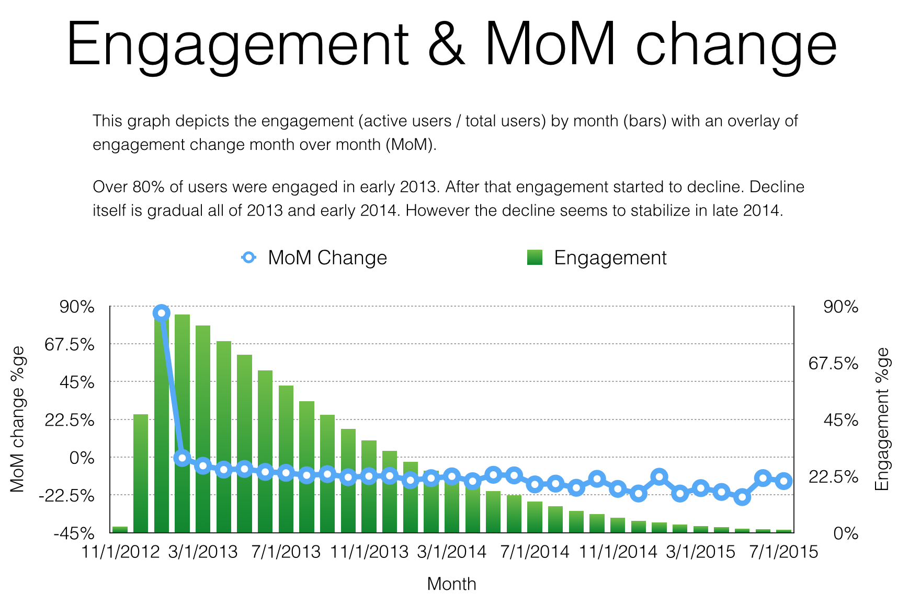
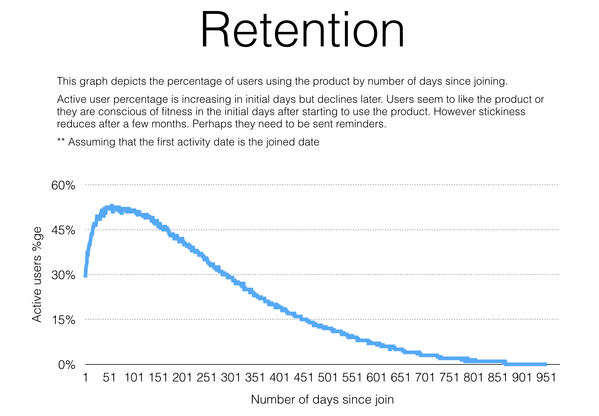
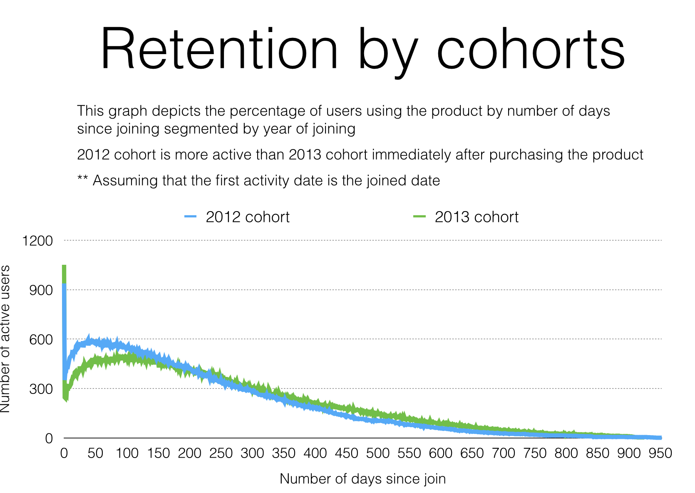
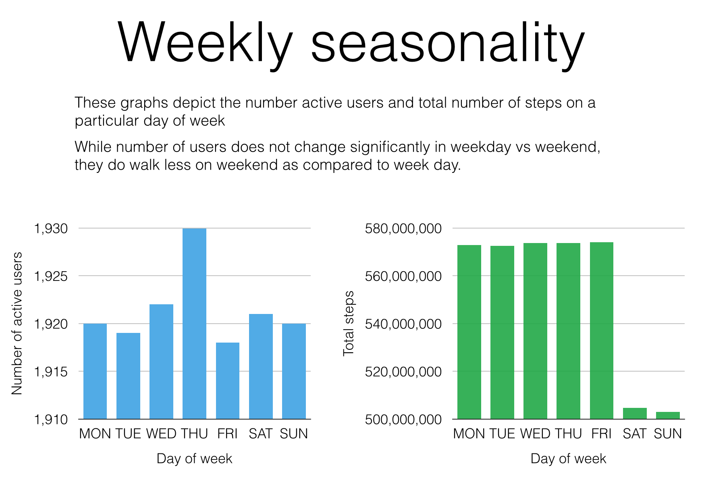

# User retention analysis
* [Daily Active Users](#Daily-Active-Users)
* [Engagement](#Engagement)
* [Retention](#Retention)
* [Retention Cohorts](#Retention-Cohorts)
* [Monthly Seasonality](#Monthly-Seasonality)
* [Monthly Seasonality Steps](#Monthly-Seasonality-Steps)
* [Weekly Seasonality](#Weekly-Seasonality)
* [User Segmentation](#User-Segmentation)
* [Setup](#setup)


## Setup 
* Run database
```
cd $PROJECT
docker-compose up -d
```
* Create postgres table
```
drop table if exists activity;
create table activity (user_id int, activity_date date, steps int);
```
* Load data
```
copy activity from '/tmp/data/activity.csv' DELIMITER ',' CSV HEADER;
select * from activity limit 10;
```

## Daily Active Users (DAU)


## Engagement


## Retention


## Retention Cohorts


## Monthly Seasonality (Users)


## Monthly Seasonality (Steps)


## Weekly Seasonality (Users)


## User Segmentation
